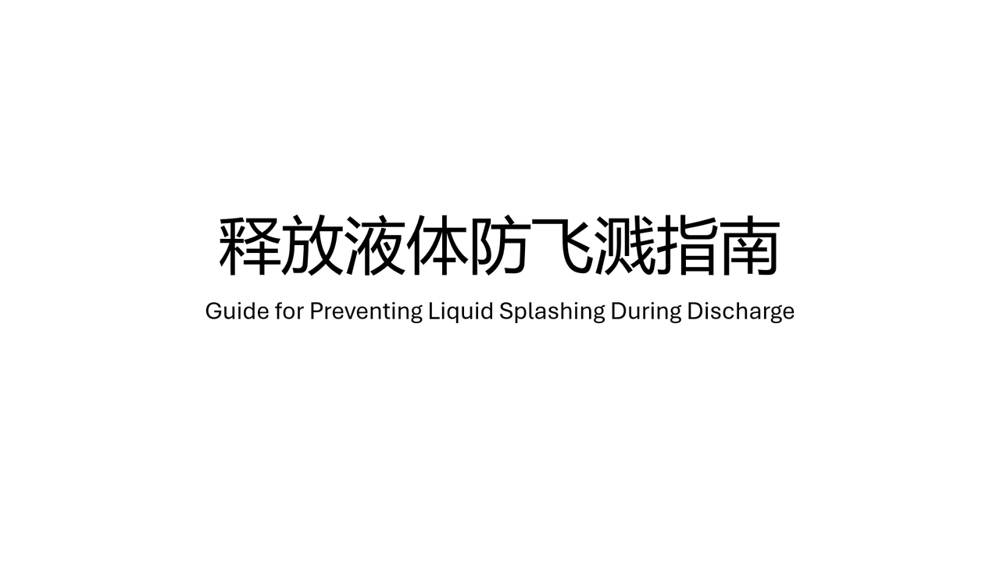

# gplsdd

> 释放液体防飞溅指南  
> Guide for Preventing Liquid Splashing During Discharge
>
> 1. 出水管口应位于合法区域的垂直上方范围内  
>    Positioning: The outlet of the discharge pipe must be positioned vertically directly above the designated area.
>
> 2. 调整出水管瞄准方向，使得以出水管瞄准方向延伸，应落于合法区域内  
>    Aiming: Adjust the direction of the discharge pipe to ensure that its extended trajectory falls entirely within the designated area.
>
> 3. 从液体开始流出至停止流动，出水管的位置和方向都应保持稳定  
>    Stability: From the moment the liquid begins to flow until it stops completely, both the position and the direction of the discharge pipe must remain completely stable.
>
> 4. 在液体停止流动后，应使用吸水物覆盖/包住出水管口，再轻轻抖动出水管，使得管内残余液体被吸水物吸附  
>    Post-Discharge Care: Once the liquid stops flowing, use an absorbent material to cover or wrap the pipe outlet, then gently shake the pipe so that any residual liquid inside is fully absorbed.

